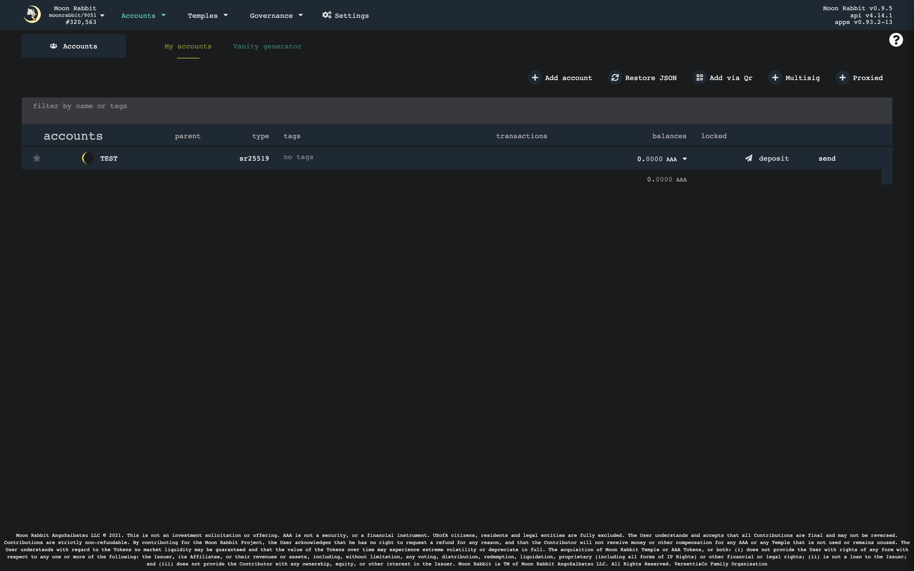
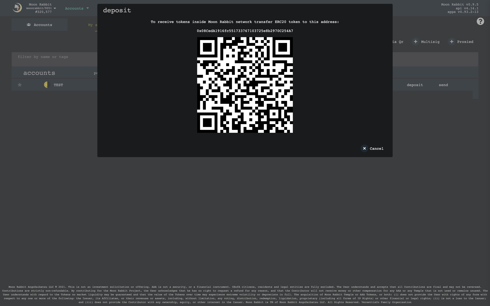

## ERC20 - Moon Rabbit Bridge

### Transfer ERC20 to Moon Rabbit

1. Open Accounts tab https://hole.moonrabbit.com/#/accounts
2. Click `Deposit` button near your account

3. You will see Ethereum address

4. Send AAA tokens inside Ethereum network to this address
5. After some time AAA tokens will be sent to your account in Moon Rabbit network
