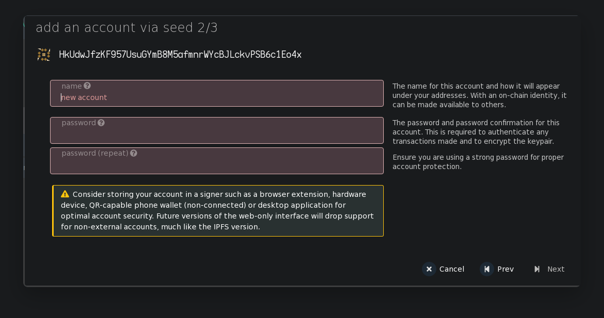
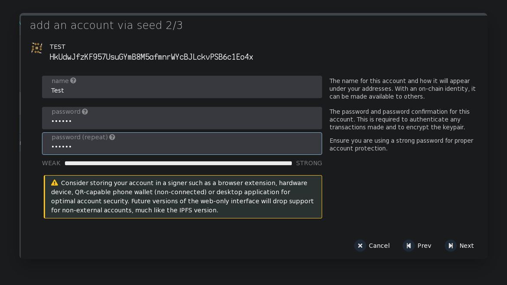
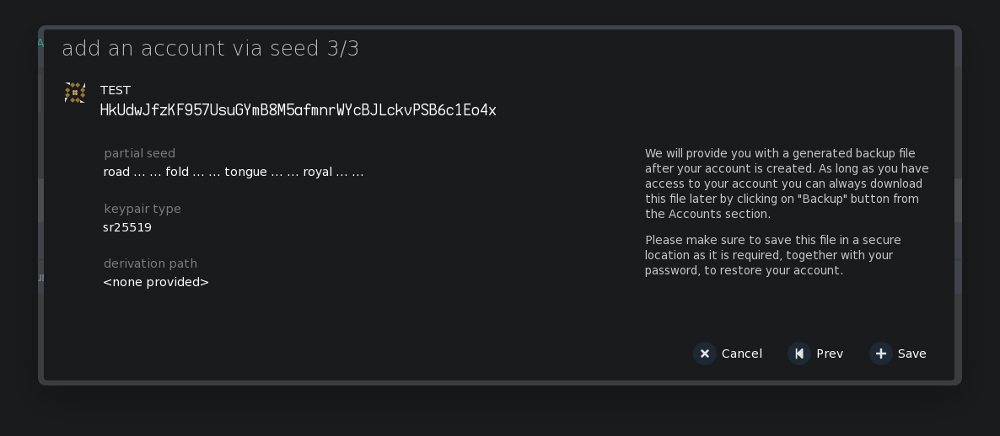

### How to generate new wallet

To create an account, click on the "add account" button

In the pop-up window you will see a randomly generated seed phrase (you should save it somewhere) and your address

Click on checkbox

At the next stage, you need to set a username and password that will be used for operations with this account

click next to continue

The next step, make sure that all the data is correct and save the account, while you will be prompted to save the json file with the data of the created account; in the future, you can use it to import the account on another device

