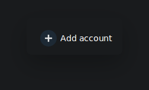
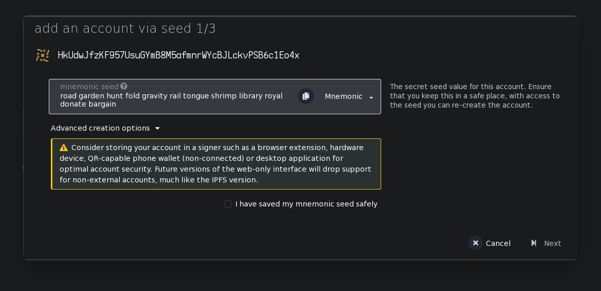
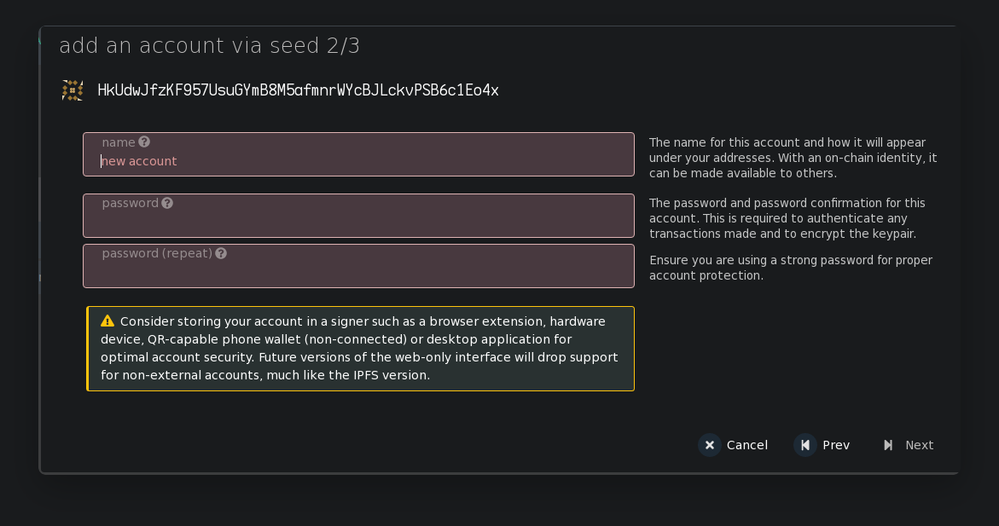
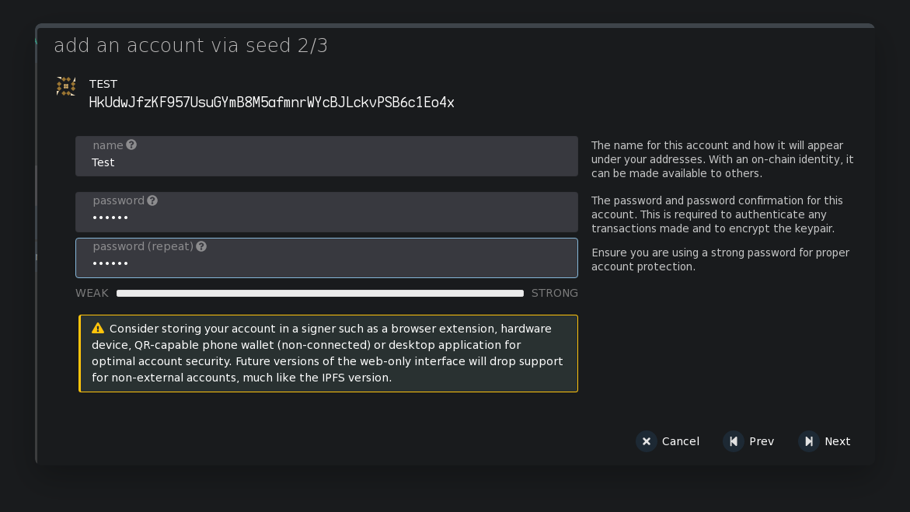
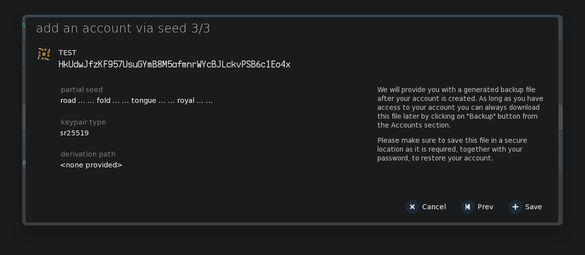
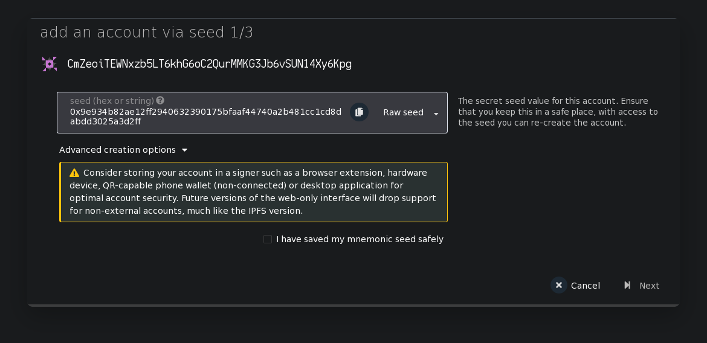
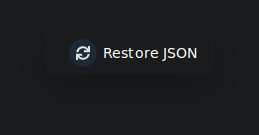
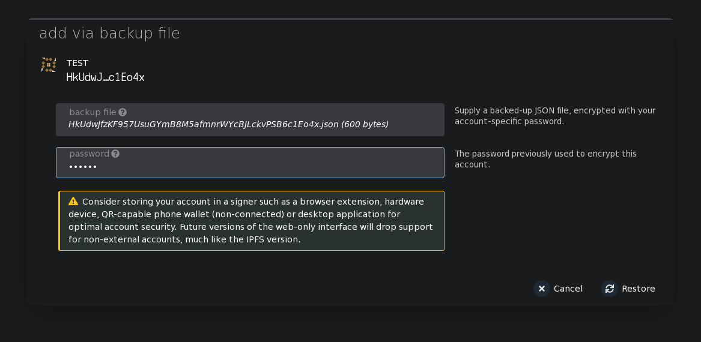

### How to import existing private key

There are 3 ways to restore or import account
1) use a mnemonic phrase
2) use a secret seed
3) use the json file obtained during registration

### Mnemonic phrase

Click on the "add account" button

Enter your mnemonic phrase

Activate checkbox

At the next stage, you need to set a username and password that will be used for operations with this account

click next to continue

The next step, make sure that all the data is correct and save the account, while you will be prompted to save the json file with the data of the created account; in the future, you can use it to import the account on another device

### Secret seed

Click on the "add account" button

If you have a secret seed, switch the input mode in the window from mnemonic to raw seed

Activate the checkbox so that you have saved the seed and are ready to continue and click next

At the next stage, you need to set a username and password that will be used for operations with the account

click next to continue

The next step, make sure that all the data is correct and save the account, while you will be prompted to save the json file with the data of the created account; in the future, you can use it to import the account on another device

### JSON file

You need to click the restore from json button on the main page

In the window that appears, you need to select the file from which the account will be imported and specify the password that will be assigned to your account

and click the restore button
