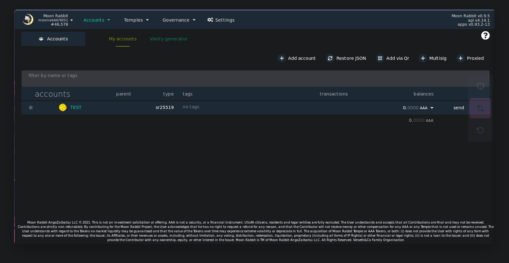
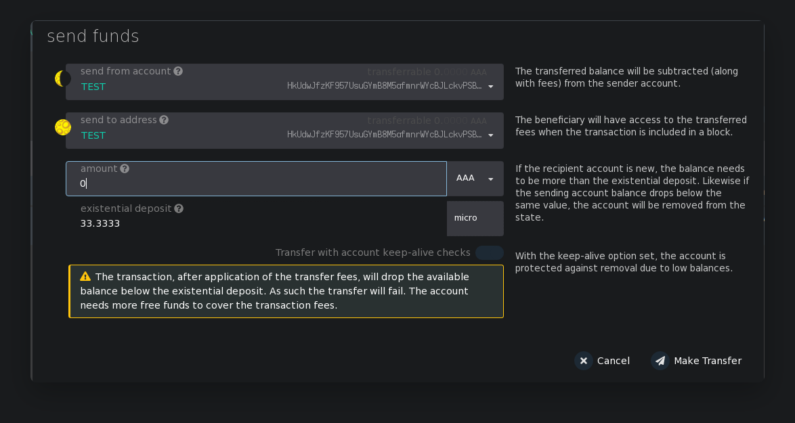
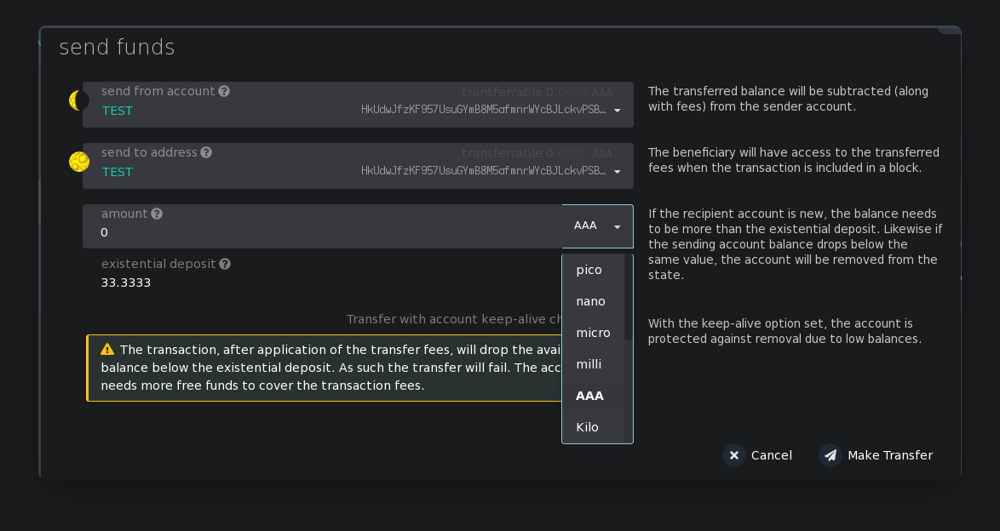
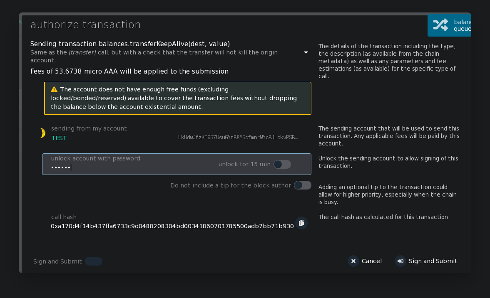
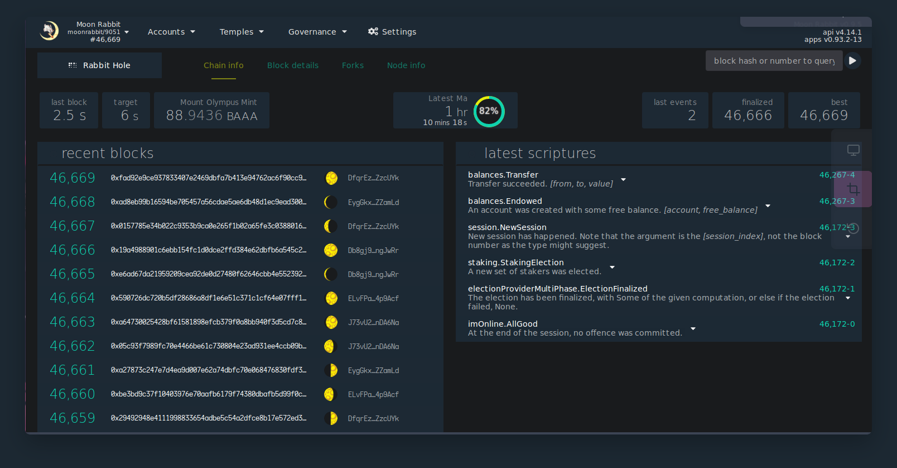
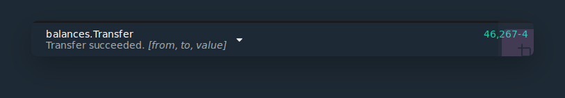

### How to send tokens

In order to transfer tokens to another account on the main page, click on the accounts button

Select the transfer point

In the window that appears, you need to select the account from which the transfer will be made, specify the ID of the recipient of the tokens, the number of tokens

please note that the part of the token may be different

pay attention to fees indicated at the end
if all data is correct, click on the make transfer button

on the next screen, you must specify the password from the account from which the transfer takes place and click the Sign and Submit button

After your transaction is successful on the Rabbit Hole page in the Temples tab

In the latest scriptures block there will be a notification about a successful transaction with a block number in which you can see the details of the transaction

